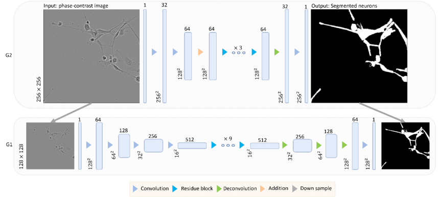
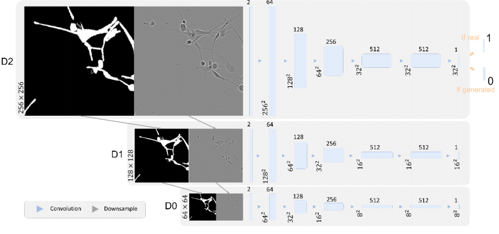
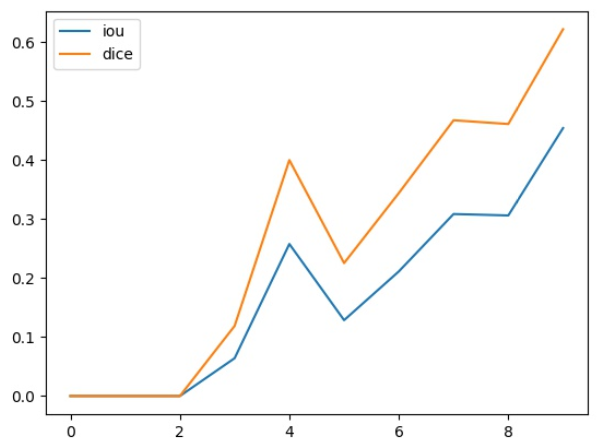

# ELEC576project - Semi-supervised Segmentation of High-resolution Neuronal Cells

## About This Repo
This repo, **Semi-supervised Segmentation of  High-resolution Neuronal Cells**, is mainly for the ELEC576 project. Here is a brief introduction of each file:
- Traditional method segmenation is in `ELEC576project/dataloaders/segmentation.py `
- Data augmentation method is implemented in `ELEC576project/dataloaders/PairedNeurons.py`
- Train the pix2pixHD model by running `ELEC576project/train_pix2pixHD.py`
- Test our model by running `ELEC576project/test_pix2pixHD.py`

## Abstract
Neuronal image segmentation is critical for neuronal morphology reconstruction and neuronal psychology study. Generally, neuronal images are segmented by experts manually. It is accurate but orders-of-magnitude more time-consuming, making handling large images and videos intractable. Automatic image segmentation methods are fast, but the weak filament intensity and strong background noise reduce the segmentation accuracy. The recent deep learning models have high accuracy and efficiency in real-world image segmentation tasks, but they have never been used to segment high-resolution neuronal images. In this project, we implemented and fine-tuned the stateof-the-art deep learning models to segment high-resolution neuronal images. Our model is over 90% more accurate than the best traditional threshold-based method. However, the semi-supervised models trained with pseudo-labels have decreased accuracy. It shows that inaccurate labels may negatively affect the model performance. The completion of our model will help the neuronal research and shed light on the other task-oriented image segmentation projects.

## Pipeline
To better process high-resolution phase-contrast microscopic images, we implemented the state-ofthe-art image transformation model for converting phase-contrast microscopic images to fluorescence microscopic images [12]. Considering about the fact that the segmented ground truth images are much simpler than the fluorescent images, and we do not have low intensity details on ground truth images. We implemented the simpler pix2pixHD model in our project (Figure 5). The model has two
levels of generators, 𝐺1 and 𝐺2. The architectures are shown as follow:


The network architecture of multi-scale discriminators. Each rectangular block represents a 3-dimensional array. The lengths and widths of the arrays are annotated on the left. The depths of the arrays are annotated as superscripts. Each arrow represents an operation step. The double-headed arrow represents the MSE calculation.


## Our Results
Compared to some of the state-of-the-art methods, our method (last row) can segment cells more accurately.


# Environment
This project depends on the following environments and packages:
- window10(Ubuntu is OK)
- python3.6
- pytorch1.3.1  

# How to Run Our Model
The only thing you should do is enter the dataset.py and correct the path of the datasets. Then run:
```python
python main.py --action 'train&test' --arch attention-unet --epoch 200 --batch_size 20
```

After train and test,3 folders will be created,they are "result","saved_model","saved_predict".

## Chart of Lines:
Our model will plot the logs and the line chart of some metrics. Such as the :



